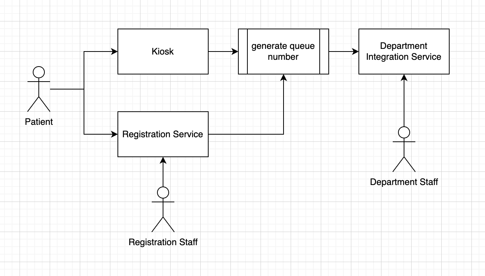
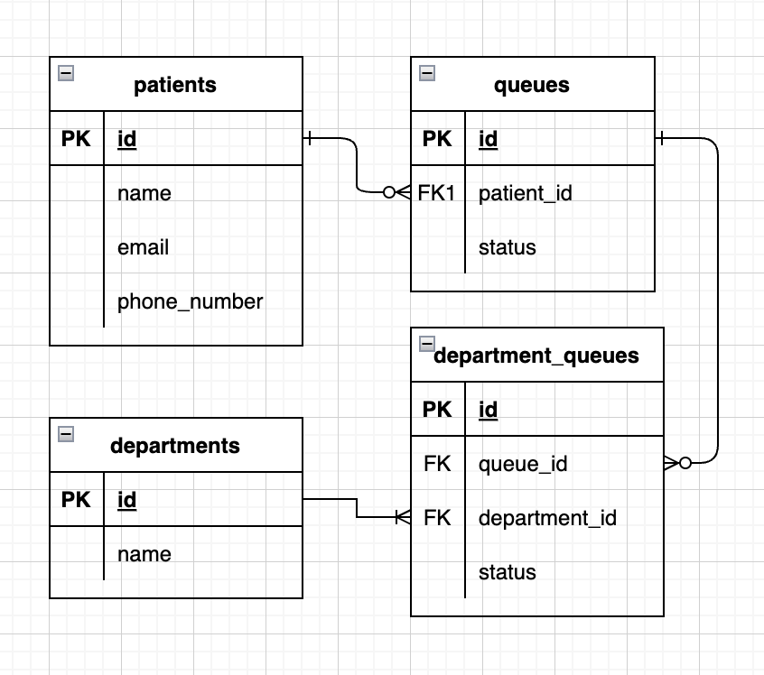

# API Design

## Patient API

### Patient Properties

#### Patients

| No. | Name         | Data Type | Description               |
| --- | ------------ | --------- | ------------------------- |
| 1.  | id           | UUID      | Patient's ID              |
| 2.  | name         | string    | Patient's Name            |
| 3.  | email        | String    | Patient's Email           |
| 4.  | phone_number | String    | Patient's Phone Number    |
| 5.  | created_at   | Timestamp | Time patient created      |
| 6.  | updated_at   | Timestamp | Time patient last updated |
| 7.  | deleted_at   | Timestamp | Time patient deleted      |

### Get patients

> [!NOTE]
> This API is used to get patient list. Returns 200 OK even though patient is empty

`[GET] /api/v1/patients`

#### Request

| No. | Name  | Required | Data Type | Description                         |
| --- | ----- | -------- | --------- | ----------------------------------- |
| 1.  | page  | FALSE    | Integer   | Page of patients (Default 1)        |
| 2.  | limit | FALSE    | Integer   | Limit item to retrieve (Default 20) |

#### Response

```json
{
  "data": {
    "patients": [
      {
        "id": "",
        "name": "",
        "email": "",
        "phone_number": "",
        "created_at": "2023-12-31 00:00:00",
        "updated_at": "2023-12-31 00:00:00",
        "deleted_at": null
      }
    ],
    "page": 1,
    "limit": 20,
    "total": 100,
    "last": false
  },
  "error_code": "",
  "message": ""
}
```

#### Error Response

```json
{
  "data": null,
  "error_code": "",
  "message": ""
}
```

#### Error Codes

| No. | Name   | HTTP Status | Description   |
| --- | ------ | ----------- | ------------- |
| 1.  | PAT000 | 500         | Unknown error |

### Create patient

> [!NOTE]
> This API is used to create patient

`[POST] /api/v1/patient`

#### Request

| No. | Name         | Required | Data Type | Description            |
| --- | ------------ | -------- | --------- | ---------------------- |
| 1.  | name         | TRUE     | String    | Patient's name         |
| 2.  | email        | TRUE     | String    | Patient's email        |
| 3.  | phone_number | TRUE     | String    | Patient's phone_number |

```json
{
  "name": "",
  "email": "",
  "phone_number": ""
}
```

#### Response

```json
{
  "data": {
    "id": "",
    "name": "",
    "email": "",
    "phone_number": "",
    "created_at": "2023-12-31 00:00:00",
    "updated_at": "2023-12-31 00:00:00",
    "deleted_at": null
  },
  "error_code": "",
  "message": ""
}
```

#### Error Response

```json
{
  "data": null,
  "error_code": "",
  "message": ""
}
```

#### Error Codes

| No. | Name   | HTTP Status | Description                                   |
| --- | ------ | ----------- | --------------------------------------------- |
| 1.  | PAT000 | 500         | Unknown error                                 |
| 2.  | PAT200 | 400         | Bad request : email already registered        |
| 3.  | PAT201 | 400         | Bad request : phone number already registered |

### Update patient

> [!NOTE]
> This API is used to update patient

`[PATCH] /api/v1/patient/{patient_id}`

#### Request

| No. | Name         | Type | Required | Data Type | Description                      |
| --- | ------------ | ---- | -------- | --------- | -------------------------------- |
| 1.  | patient_id   | PATH | TRUE     | UUID      | Patient's ID                     |
| 3.  | name         | JSON | FALSE    | String    | To change patient's name         |
| 3.  | email        | JSON | FALSE    | String    | To change patient's email        |
| 4.  | phone_number | JSON | FALSE    | String    | To change patient's phone number |

```json
{
  "name": "",
  "email": "",
  "phone_number": ""
}
```

#### Response

```json
{
  "data": {
    "id": "",
    "name": "",
    "email": "",
    "phone_number": "",
    "created_at": "2023-12-31 00:00:00",
    "updated_at": "2023-12-31 00:00:00",
    "deleted_at": null
  },
  "error_code": "",
  "message": ""
}
```

#### Error Response

```json
{
  "data": null,
  "error_code": "",
  "message": ""
}
```

#### Error Codes

| No. | Name   | HTTP Status | Description                                   |
| --- | ------ | ----------- | --------------------------------------------- |
| 1.  | PAT000 | 500         | Unknown error                                 |
| 2.  | PAT300 | 400         | Bad request : patient not found               |
| 3.  | PAT301 | 400         | Bad request : email already registered        |
| 4.  | PAT302 | 400         | Bad request : phone number already registered |

## Department API

### Department Properties

#### Departments

| No. | Name       | Data Type | Description                  |
| --- | ---------- | --------- | ---------------------------- |
| 1.  | id         | UUID      | Department's ID              |
| 2.  | name       | string    | Department's Name            |
| 3.  | created_at | Timestamp | Time department created      |
| 4.  | updated_at | Timestamp | Time department last updated |
| 5.  | deleted_at | Timestamp | Time department deleted      |

### Get departments

> [!NOTE]
> This API is used to get department list. Returns 200 OK even though department is empty

`[GET] /api/v1/departments`

#### Request

| No. | Name  | Required | Data Type | Description                         |
| --- | ----- | -------- | --------- | ----------------------------------- |
| 1.  | page  | FALSE    | Integer   | Page of departments (Default 1)     |
| 2.  | limit | FALSE    | Integer   | Limit item to retrieve (Default 20) |

#### Response

```json
{
  "data": {
    "departments": [
      {
        "id": "",
        "name": "",
        "created_at": "2023-12-31 00:00:00",
        "updated_at": "2023-12-31 00:00:00",
        "deleted_at": null
      }
    ],
    "page": 1,
    "limit": 20,
    "total": 100,
    "last": false
  },
  "error_code": "",
  "message": ""
}
```

#### Error Response

```json
{
  "data": null,
  "error_code": "",
  "message": ""
}
```

#### Error Codes

| No. | Name   | HTTP Status | Description   |
| --- | ------ | ----------- | ------------- |
| 1.  | DAT000 | 500         | Unknown error |

### Create department

> [!NOTE]
> This API is used to create department

`[POST] /api/v1/department`

#### Request

| No. | Name | Required | Data Type | Description       |
| --- | ---- | -------- | --------- | ----------------- |
| 1.  | name | TRUE     | String    | Department's name |

```json
{
  "name": ""
}
```

#### Response

```json
{
  "data": {
    "id": "",
    "name": "",
    "created_at": "2023-12-31 00:00:00",
    "updated_at": "2023-12-31 00:00:00",
    "deleted_at": null
  },
  "error_code": "",
  "message": ""
}
```

#### Error Response

```json
{
  "data": null,
  "error_code": "",
  "message": ""
}
```

#### Error Codes

| No. | Name   | HTTP Status | Description                                 |
| --- | ------ | ----------- | ------------------------------------------- |
| 1.  | DAT000 | 500         | Unknown error                               |
| 2.  | DAT200 | 400         | Bad request : department already registered |

### Update department

> [!NOTE]
> This API is used to update department

`[PATCH] /api/v1/department/{department_id}`

#### Request

| No. | Name          | Type | Required | Data Type | Description                 |
| --- | ------------- | ---- | -------- | --------- | --------------------------- |
| 1.  | department_id | PATH | TRUE     | UUID      | Department's ID             |
| 2.  | name          | JSON | FALSE    | String    | To change department's name |

```json
{
  "name": ""
}
```

#### Response

```json
{
  "data": {
    "id": "",
    "name": "",
    "created_at": "2023-12-31 00:00:00",
    "updated_at": "2023-12-31 00:00:00",
    "deleted_at": null
  },
  "error_code": "",
  "message": ""
}
```

#### Error Response

```json
{
  "data": null,
  "error_code": "",
  "message": ""
}
```

#### Error Codes

| No. | Name   | HTTP Status | Description                                 |
| --- | ------ | ----------- | ------------------------------------------- |
| 1.  | DAT000 | 500         | Unknown error                               |
| 2.  | DAT300 | 400         | Bad request : department not found          |
| 3.  | DAT301 | 400         | Bad request : department already registered |

## Queue API

### Queue Properties

#### Queues

| No. | Name       | Data Type | Description                                 |
| --- | ---------- | --------- | ------------------------------------------- |
| 1.  | id         | UUID      | Queue's ID                                  |
| 2.  | patient_id | UUID      | Patient's ID                                |
| 3.  | status     | String    | Queue's status [WAITING, IN_PROGRESS, DONE] |
| 4.  | created_at | Timestamp | Time queue created                          |
| 5.  | updated_at | Timestamp | Time queue last updated                     |
| 6.  | deleted_at | Timestamp | Time queue deleted                          |

#### Department's Queue

| No. | Name          | Data Type | Description                                 |
| --- | ------------- | --------- | ------------------------------------------- |
| 1.  | id            | UUID      | Department queue's ID                       |
| 2.  | queue_id      | UUID      | Queue's ID                                  |
| 3.  | department_id | UUID      | Department's ID                             |
| 4.  | status        | String    | Queue's status [WAITING, IN_PROGRESS, DONE] |
| 5.  | created_at    | Timestamp | Time department queue's created             |
| 6.  | updated_at    | Timestamp | Time department queue's last updated        |
| 7.  | deleted_at    | Timestamp | Time department queue's deleted             |

### Get queue list

> [!NOTE]
> This API is used to get queue list. Returns 200 OK even though queue is empty.

`[GET] /api/v1/queue`

#### Request

| No. | Name       | Required | Data Type | Description                         |
| --- | ---------- | -------- | --------- | ----------------------------------- |
| 1.  | page       | FALSE    | Integer   | Page of queues (Default 1)          |
| 2.  | limit      | FALSE    | Integer   | Limit item to retrieve (Default 20) |
| 3.  | patient_id | FALSE    | UUID      | Search by patient's id              |
| 4.  | status     | FALSE    | String    | Filter by queue status              |

#### Response

```json
{
  "data": {
    "queues": [
      {
        "id": "",
        "patient_id": "",
        "status": "",
        "department_queues": [
          {
            "id": "",
            "department": "",
            "status": ""
          }
        ],
        "created_at": "2023-12-31 00:00:00",
        "updated_at": "2023-12-31 00:00:00",
        "deleted_at": null
      }
    ],
    "page": 1,
    "limit": 20,
    "total": 100,
    "last": false
  },
  "error_code": "",
  "message": ""
}
```

#### Error Response

```json
{
  "data": null,
  "error_code": "",
  "message": ""
}
```

#### Error Codes

| No. | Name   | HTTP Status | Description   |
| --- | ------ | ----------- | ------------- |
| 1.  | QUE000 | 500         | Unknown error |

### Get queue status

> [!NOTE]
> This API is used to get queue status

`[GET] /api/v1/queue/patient/{patient_id}`

#### Request

| No. | Name       | Required | Data Type | Description          |
| --- | ---------- | -------- | --------- | -------------------- |
| 1.  | patient_id | TRUE     | UUID      | Search by patient id |

#### Response

```json
{
  "data": {
    "queue": {
      "id": "",
      "patient_id": "",
      "status": "",
      "queue_count": 0, // get queue count
      "department_queue": {
        // only retrieve latest status of the department queue
        "id": "",
        "department_id": "",
        "status": ""
      },
      "created_at": "2023-12-31 00:00:00",
      "updated_at": "2023-12-31 00:00:00",
      "deleted_at": null
    }
  },
  "error_code": "",
  "message": ""
}
```

#### Error Response

```json
{
  "data": null,
  "error_code": "",
  "message": ""
}
```

#### Error Codes

| No. | Name   | HTTP Status | Description     |
| --- | ------ | ----------- | --------------- |
| 1.  | QUE000 | 500         | Unknown error   |
| 2.  | QUE200 | 404         | Queue not found |

### Create queue

> [!NOTE]
> This API is used to create queue

`[POST] /api/v1/queue`

#### Request

| No. | Name       | Required | Data Type | Description  |
| --- | ---------- | -------- | --------- | ------------ |
| 1.  | patient_id | TRUE     | UUID      | Patient's ID |

```json
{
  "patient_id": ""
}
```

#### Response

```json
{
  "data": {
    "id": "",
    "patient_id": "",
    "status": "",
    "queue_count": 0, // this count
    "created_at": "2023-12-31 00:00:00",
    "updated_at": "2023-12-31 00:00:00",
    "deleted_at": null
  },
  "error_code": "",
  "message": ""
}
```

#### Error Response

```json
{
  "data": null,
  "error_code": "",
  "message": ""
}
```

#### Error Codes

| No. | Name   | HTTP Status | Description                     |
| --- | ------ | ----------- | ------------------------------- |
| 1.  | QUE000 | 500         | Unknown error                   |
| 2.  | QUE300 | 400         | Bad request : patient not found |

### Update Queue

> [!NOTE]
> This API is used to update queue or move to another department

`[PATCH] /api/v1/queue/patient/{patient_id}`

#### Request

| No. | Name               | Type | Required | Data Type | Description                                                                          |
| --- | ------------------ | ---- | -------- | --------- | ------------------------------------------------------------------------------------ |
| 1.  | patient_id         | Path | TRUE     | UUID      | Patient ID to update                                                                 |
| 2.  | department_id      | JSON | TRUE     | UUID      | Department's ID                                                                      |
| 3.  | next_department_id | JSON | FALSE    | UUID      | Next Department's ID                                                                 |
|     |                    |      |          |           | Only fill this value to complete the current active queue in respective department   |
|     |                    |      |          |           | If empty, this will change the department queue's status from WAITING to IN_PROGRESS |

```json
{
  "department_id": "",
  "next_department_id": ""
}
```

#### Response

```json
{
  "data": {
    "queue": {
      "id": "",
      "patient_id": "",
      "status": "IN_PROGRESS",
      "department_queue": [
        {
          "id": "",
          "department_id": "",
          "status": "WAITING"
        },
        {
          "id": "",
          "department_id": "",
          "status": "DONE"
        }
      ],
      "created_at": "2023-12-31 00:00:00",
      "updated_at": "2023-12-31 00:00:00",
      "deleted_at": null
    }
  },
  "error_code": "",
  "message": ""
}
```

#### Error Response

```json
{
  "data": null,
  "error_code": "",
  "message": ""
}
```

#### Error Codes

| No. | Name   | HTTP Status | Description                             |
| --- | ------ | ----------- | --------------------------------------- |
| 1.  | QUE000 | 500         | Unknown error                           |
| 2.  | QUE400 | 400         | Bad request : patient not found         |
| 3.  | QUE401 | 400         | Bad request : department not found      |
| 4.  | QUE402 | 400         | Bad request : next department not found |

---

# System Design



1. Patient register data to registration service or go to kiosk to generate queue number
2. Generated queue will be processed and directed to respective department
3. Department staff will process each of patients one by one and set as done after the consultation done
4. Last department (payment) will complete the queue if the payment is done 

---

# Database Design

## ERD



## Table

```sql
CREATE TABLE patients
(
  id          UUID NOT NULL,
  name        TEXT NOT NULL,
  email       TEXT NOT NULL,
  created_at  TIMESTAMP WITH TIME ZONE DEFAULT CURRENT_TIMESTAMP,
  updated_at  TIMESTAMP WITH TIME ZONE,
  deleted_at  TIMESTAMP WITH TIME ZONE,
  deleted     BOOLEAN DEFAULT FALSE,

  CONSTRAINT patients_id_pkey PRIMARY KEY (id),
  CONSTRAINT patients_email_unique UNIQUE (email),
  CONSTRAINT patients_phone_number_unique UNIQUE (phone_number)
);
CREATE INDEX IF NOT EXISTS patients__index_query_by_email ON patients (email);
CREATE INDEX IF NOT EXISTS patients__index_query_by_phone_number ON patients (phone_number);

CREATE TABLE departments
(
  id  UUID NOT NULL,
  name        TEXT NOT NULL,
  created_at  TIMESTAMP WITH TIME ZONE DEFAULT CURRENT_TIMESTAMP,
  updated_at  TIMESTAMP WITH TIME ZONE,
  deleted_at  TIMESTAMP WITH TIME ZONE,
  deleted     BOOLEAN DEFAULT FALSE,

  CONSTRAINT departments_id_pkey PRIMARY KEY (id)
);
CREATE INDEX IF NOT EXISTS departments__index_query_by_name ON departments (name);

CREATE TABLE queues
(
  id          UUID NOT NULL,
  patient_id  UUID NOT NULL,
  status      TEXT NOT NULL,
  created_at  TIMESTAMP WITH TIME ZONE DEFAULT CURRENT_TIMESTAMP,
  updated_at  TIMESTAMP WITH TIME ZONE,
  deleted_at  TIMESTAMP WITH TIME ZONE,
  deleted     BOOLEAN DEFAULT FALSE,

  CONSTRAINT queues_id_pkey PRIMARY KEY (id),
  CONSTRAINT queues_patient_id_fkey FOREIGN KEY (patient_id) REFERENCES queues(patient_id)
);
CREATE INDEX IF NOT EXISTS queues__index_query_by_patient_id ON queues (patient_id);
CREATE INDEX IF NOT EXISTS queues__index_query_by_status ON queues (status);

CREATE TABLE department_queues
(
  id          UUID NOT NULL,
  queue_id    UUID NOT NULL,
  status      TEXT NOT NULL,
  created_at  TIMESTAMP WITH TIME ZONE DEFAULT CURRENT_TIMESTAMP,
  updated_at  TIMESTAMP WITH TIME ZONE,
  deleted_at  TIMESTAMP WITH TIME ZONE,
  deleted     BOOLEAN DEFAULT FALSE,

  CONSTRAINT department_queues_id_pkey PRIMARY KEY (id),
  CONSTRAINT department_queues_queue_id_fkey FOREIGN KEY (queue_id) REFERENCES department_queues(queue_id)
);
CREATE INDEX IF NOT EXISTS queues__index_query_by_queue_id ON queues (queue_id);
CREATE INDEX IF NOT EXISTS queues__index_query_by_status ON queues (status);
```
